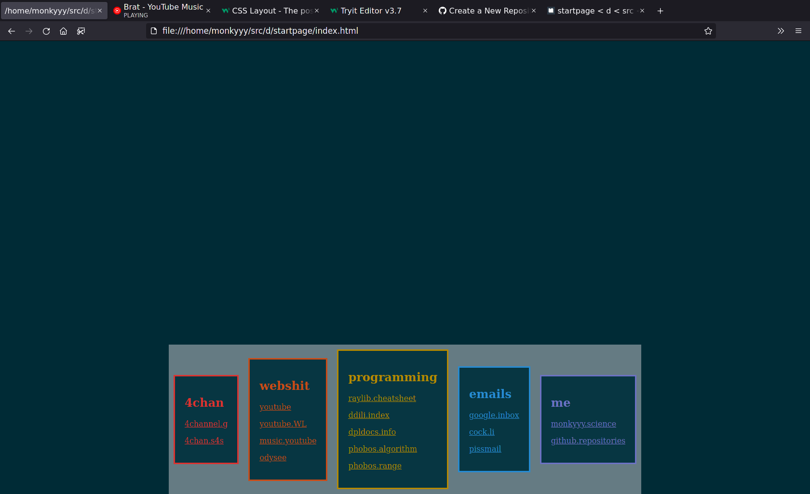

generate your own start page

## steps
1. make a .lks file (see example.lks for syntax)
2. pick a color scheme from https://github.com/crazymonkyyy/leet-haker-colors
3. dmd -J=. -i -run startpage.d .lks colorscheme image/"none" output.html
4. tell your broswer to open tabs on the generated html page

----

## todo

more examples

